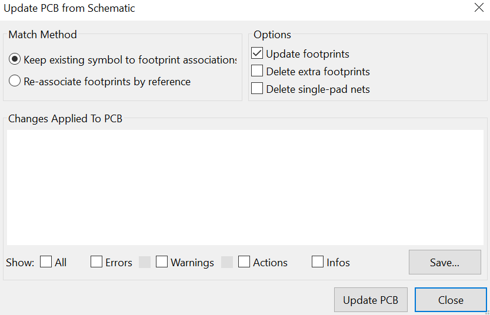

# KiCad-remap-ref-designators-in-sch

An attempt to make manual back-annotation from PCB to schematics in [KiCad](https://www.kicad.org/) easier and safer

## Foreword

With KiCad (version 5.1.6, as of writing), it seems there is no way to rename [reference designator](https://en.wikipedia.org/wiki/Reference_designator)s in PCB for an more logical localization of them on the PCB

It also exists some tools which reorganize reference designators automatically (horizontally then vertically on the PCB or the opposite) and re-synchronize PCB and schematics. Those tools are quite old not reliable and suffer from another limitation according to some needs: they affect all the components and for some like connectors this is not always desirable

The idea of a manual reorganization from the PCB came as not very fast but more reliable

## Work-flow

The order of tasks this program proposes is:

- Locate on the PCB, which reference designators need being reorganized

- And in a text file (or in a worksheet which will be saved as tab separated values), write lines with two values separated by a tab character: on the left the existing reference designator to be replaced and on the right the new reference designator

- Present program will take this text file and *patch* the .sch schematics file

- Then synchronization of PCB file done by KiCad with *Tools* / *Update PCB from Schematic* opting with default Match Method: *Keep existing symbol to footprint association*

  

## How To

This is a command line program (default name is `KcdMapRefsInSc`)

Just launch it with a single parameter with the KidCad project name without any extension: let call it `KiCadProjectName` for sake of the example

At least two files are supposed to exist: `KiCadProjectName.sch` and `KiCadProjectName.refMap`, first being schematic file and the other one the tab-separated list of reference designators existing in the schematics followed by the new reference designators

Program will check consistency in those files: no duplicates in schematic file before and after replacements, no duplicates in old and new reference designators listed in `.refMap`, all old reference designators exist in schematic file

When this done `KiCadProjectName.sch` is rewritten and a backup file is created: `KiCadProjectName.orgRefMap.sch`. Note this process if backup file already existed

Any error or failure during verifications will result in an error message displayed and no file to be written to disk

When this is done, as already explained, it is up the user to update its PCB from the schematic file

### Options

`--overwrite` will proceed even if `orgRefMap.sch` backup file already existed

`--dryrun` will run the entire process, however nothing will be written

`--verbose` normally as long is okay, no display is output. With this option every step is displayed

### Limitations

Hierarchical schematic files are supported and all altered schematic file required by the process will be altered

The process is governed by `$Sheet` entries found in the main/project schematic file. In any schematic file, reference designators are supposed to be defined by a `$Comp` entry and also repeated on its `F 0` field. With hierarchical schematic files, it seems more complex definitions exist involving *path* fields within $Comp definitions. By lack of knowledge of this peculiar syntax (we only had the old *Kidcad_file_format.pdf* included in this project as a reference), it is presently unsupported and will result in an error. Any input on this syntax will be welcome

## Source Code

Source code is written in C# and was developed under Visual Studio 2019

Two dependencies are necessary for building this project:

- [CommandLineParser](https://github.com/commandlineparser/commandline) which manages command line parameters and options
- [ILMerge](https://github.com/dotnet/ILMerge) which merges output executable file and `.dll` file made by *CommandLineParser* into a single  executable file, store into `/bin` folder (automatically as a Post-build script when compiling release project)

## Binary for Windows

A binary for Windows with at least `.Net` runtime at version 4.7.2 is stored in `/bin` folder under name `KcdMapRefsInSc.exe`. It works out of the box

